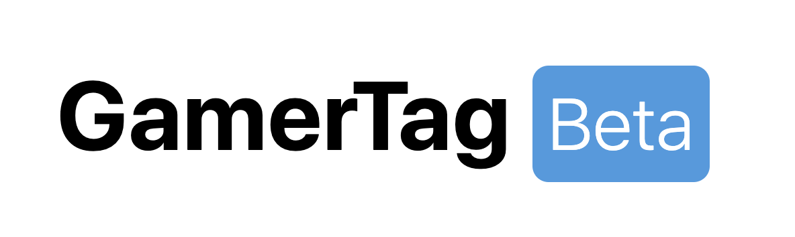
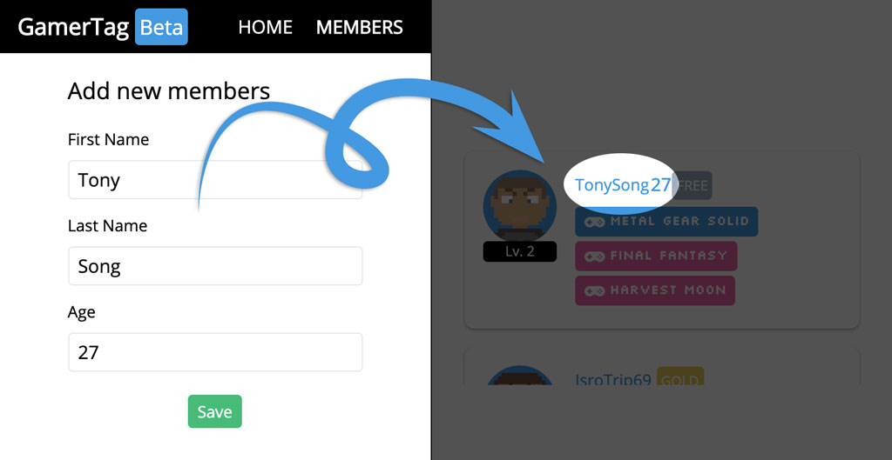
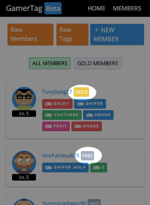

#### Phase-1 Final Live Code
# Gamer Tag  


## Introduction



Suatu komunitas Gaming sedang melakukan delegasi untuk membuat sistem kecil untuk membuat generator "Gamer Tag" yang menunjukkan status level pemain dan tag pemain.

Komunitas tersebut ingin anda membuat dengan _code_ yang sangat **minimal** karena akan dimodifikasi oleh _internal developer_ untuk dicocokkan dengan kebutuhkan mereka.

Oleh karena itu, data member dan level gamer akan di-_input_ dengan manual.

## Side notes

> Tampilan tidak akan dinilai, yang hanya dinilai adalah **code backend/server**, jangan berlama-lama berurusan dengan tampilan

> Demo tersedia di: https://gamertagbeta.herokuapp.com

> Server disarankan berjalan di port **3000**

## Release 0
1. Buatlah database dengan struktur `1 to many `sebagai berikut:

   - Tabel `Members`
     
       | Field     | Type    |
       | --------- | ------- |
       | id        | Integer |
       | firstName | String  |
       | lastName  | String  |
       | username  | String  |
       | type      | String  |
       | exp       | Integer |

   - Tabel `Tags`
     
       | Field | Type    |
       | ----- | ------- |
       | id    | Integer |
       | name  | String  |

2. Buatlah Model dan Migration dengan struktur database diatas.

3. Buatlah migration baru untuk menghubungkan relasi `1 to many` pada tabel `Members` dan `Tags`, kuncinya adalah **satu member bisa memiliki banyak tag**.

## Release 1
1. Pada route `/members`, buat link menuju ke route berikut:
   - `/raw/members` res.send() semua isi table Members
   - `/raw/tags` res.send() semua isi table Tags

2. Buat form untuk meng-input data member pada route `/members/add`
   - `id` autoincrement
   - `firstName` dari input `firstName`
   - `lastName` dari input `lastName`
   - `age` dari input `age`
   - `username` hasil kombinasi `firstName` + `lastName` + `age` dengan `hook`
   - `type` secara default bernilai `"free"` dengan `hook`
   - `exp` secara default bernilai `"0"` dengan `hook`



3. Pada route `/members` tampilkan daftar member beserta detailnya dan link menuju ke halaman 1 member.
   
## Release 1

Buat halaman untuk menampilkan detail satu member pada route `/members/<id>`, tampilkan nama lengkap, diikut dengan `type` dan jumlah `exp`.

pada halaman ini juga, **buat form** untuk menambah gamer tag sesuai member id pada halaman yang akan di submit dengan POST `/members/<id>/createtag`

> Tambahkan validasi "Tag tidak boleh kosong" pada model

## Release 2
Tampilkan tag-tag yang dimiliki member, query boleh menggunakan `include`.

## Release 3

Masih pada halaman `/members/<id>`, buat tombol untuk menambah **500** exp pada member id pada halaman, dengan link yang menuju ke route `/members/<id>/addexp`


## Release 4

Buatlah validasi agar exp tidak dapat ditambahkan ketika exp sudah bernilai 5000

## Release 5

Tampilkan level dengan patokan `exp` menggunakan **instance method** dengan format sebagai berikut:

```
exp > 1000 = level 2
exp > 1500 = level 3
exp > 2000 = level 4
exp > 3000 = level 5
otherwise level 1
```

## Release 6

Masih pada halaman `/members/<id>`, buatlah tombol untuk menghapus member yang juga menghapus semua tag yang dimilikinya.

## Release 7

Buat `model validation` member tidak dapat memiliki lebih dari 3 tag apabila type member adalah `free`.

## Release 8

Buat tombol untuk meng-upgrade free member menjadi gold member dengan route `/members/<id>/upgrade`.

> Tombol upgrade **jangan** ditampilkan bila member sudah menjadi 'gold'

## Release 9

Buat **static method** pada model `Member` untuk menampilkan gold member saja dengan format route sebagai berikut:
- `/members` menampilkan semua member free maupun gold
- `/members/?gold=1` menampilkan member gold saja

Tampilkan link menuju kedua routes diatas pada route `/members`.

## Release 10

Buatlah helper function untuk mengubah warna tulisan member yang free dan gold, contohnya member yang gold berwarna kuning pada tulisan `Gold` nya.



> tidak wajib sesuai gambar, boleh warna tulisan saja atau dengan indikasi lain, misalnya gold member tulisan goldnya diawali dengan 🏆, contoh: [🏆 GOLD]

## Release 11

Buatlah navigasi untuk menuju ke `/` (homepage) dan `/members` pada setiap halaman dengan menggunakan partials.

## Release 12

Pada route `/` (homepage) tampilkan jumlah member yang terdaftar.

## Release 13
Buat seed `MemberSeeder` untuk menambahkan anda sendiri ke dalam tabel `Members` tanpa melalui form.

<p style="text-align: center;">~ 🔥 Goodluck 🔥 ~</p>