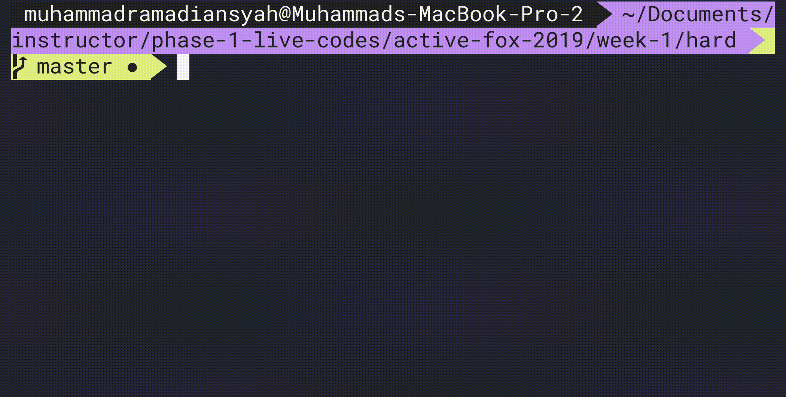

# Kucing Menyeberang Sungai #
###### estimasi waktu: 60 Menit

Seekor kucing ingin melintasi sebuah lahan yang terpotong dua aliran sungai secara vertikal.

Buatlah sebuah penggambaran langkah yang diambil oleh kucing tersebut

## Release 0
Dengan menerima 4 parameter berikut
 - lebar lahan
 - panjang lahan
 - posisi sungai dari sisi kiri lahan 
 - posisi sungai kedua dari sisi kiri lahan


Buatlah sebuah board yang menggambarkan lahan tersebut
Contoh : 
```javascript
  crossingRiver(5, 6, 3, 5))
  [
     [' ', ' ', '| |', ' ', '| |', ' ']
     [' ', ' ', '| |', ' ', '| |', ' ']
     [' ', ' ', '| |', ' ', '| |', ' ']
     [' ', ' ', '| |', ' ', '| |', ' ']
     [' ', ' ', '| |', ' ', '| |', ' ']
  ]
```

## Release 1
Gambarkan posisi kucing tersebut dan jembatan pada sungai dengan ketentuan sebagai berikut
- Asumsi posisi kedua sungai tidak mungkin berada di paling kiri atau paling kanan lahan
- Posisi kucing tersebut ada dipaling kiri atau dikolom pertama lahan namun posisi row nya diacak
- Pada aliran sungai pertama terdapat 1 jembatan yang poisinya acak
- Pada aliran sungai kedua terdapat 1 jembatan yang posisinya acak
- Apabila aliran sungai pertama dan aliran sungai kedua bersebalahan maka posisi acak jembatan 2 sama dengan posisi acak jembatan satu

### Example
```javascript
  crossingRiver(5, 6, 3, 5))
  [
     [' ', ' ', '| |', ' ', '===', ' ']
     [' ', ' ', '===', ' ', '| |', ' ']
     ['O', ' ', '| |', ' ', '| |', ' ']
     [' ', ' ', '| |', ' ', '| |', ' ']
     [' ', ' ', '| |', ' ', '| |', ' ']
  ]
```

## Release 2
Animasikan perjalanan kucing tersebut untuk mencapai sisi paling kanan lapangan lahan tersebut.

Contoh : 
```javascript
  crossingRiver(5, 6, 3, 5))
  [
     [' ', ' ', '| |', ' ', '===', 'O']
     [' ', ' ', '===', ' ', '| |', ' ']
     [' ', ' ', '| |', ' ', '| |', ' ']
     [' ', ' ', '| |', ' ', '| |', ' ']
     [' ', ' ', '| |', ' ', '| |', ' ']
  ]
```

### Animasi
