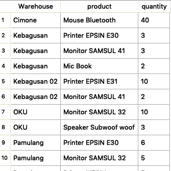
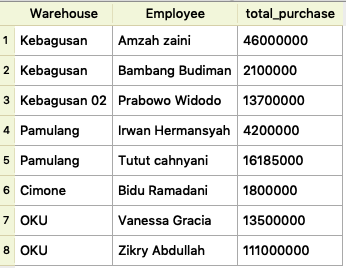
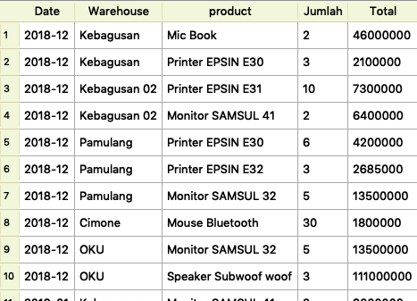

# QUERY (estimasi 30 Menit)

### Dilarang menggunakan View, Sub-query

Dalam section query ini table yang akan digunakan sebagai berikut
  1. Products, merepresentasikan data produk yang tersedia
  2. Storages, merepresentasikan data warehouse/gudang penyimpanan produk
  3. Purchase_Orders, merepresentasikan pembelian produk yang kemudian akan di simpan ke dalam warehouse yang tersedia. Asumsi setiap transaksi hanya untuk 1 jenis produk dan ke satu warehouse

**Data telah disediakan dan kamu hanya cukup membuat Querynya saja.**
### Dalam tugas ini yang dinilai hanya querynya saja.

## Release 0

- Tampilkan jumlah  produk pada setiap gudang/warehouse, serta urutkan berdasarkan nama gudang secara ASCENDING dan jumlah produk yang tersedia dan terbanyak.

## Release 1

- Tampilkan total pembelian masing-masing employee dikelompokan berdasarkan Warehouse/Gudang selama bulan desember 2018.

## Release 2

- Tampilkan quantity pembelian dan total pembelian dan dikelompakkan berdasarkan warehouse dan produk setiap bulannya. 

