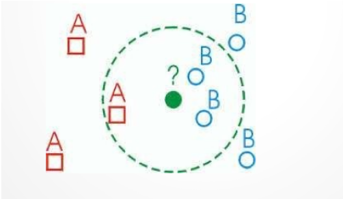

# K Nearest Neighbours
***Tell me about your friends (who your neighbors are) and I will tell you who you are***

K Nearest Neighbours adalah algorithma untuk menentukan atau memprediksi suatu label berdasarkan jumlah tetangga disekitarnya.

Buatlah fungsi bernama `kNearestNeighbours` yang menerima dua parameter
  - data: multidimensional array yang berisi distribusi target prediksi dan class. X merupakan target yang harus diprediksi sedangkan yang lainnya adalah label yang terdapat pada data.
  - k: jumlah tetangga untuk memprediksi target

### ILUSTRASI KERJA KNN

Berdasarkan ilustrasi gambar diatas, target merupakan label *B* karena (asumsi nilai k = 3) jumlah tetangga terdekat paling banyak adalah label *B*

## RELEASE 0
  Dapatkan koordinat dari masing-masing label dan target.

## RELEASE 1
  Dapatkan jarak antara target dengan masing-masing label serta urutkan berdasarkan jarak yang paling dekat dengan koordinat target prediksi.

## RELEASE 2
  Prediksi label target berdasarkan jumlah tetangga terbanyak yang ditentukan dari nilai `k`. 