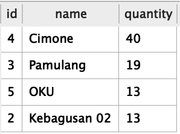
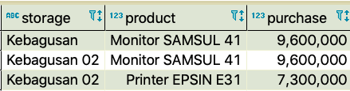

# QUERY

> ⏰ Time Estimation: ~20 mins

Dalam section query ini table yang akan digunakan sebagai berikut
  1. Products, merepresentasikan data produk yang tersedia
  2. Storages, merepresentasikan data gudang penyimpanan produk
  3. Purchase_Orders, merepresentasikan pembelian produk yang kemudian akan di simpan ke dalam gudang yang tersedia. Asumsi setiap transaksi hanya untuk 1 jenis produk dan ke satu warehouse

**Database telah disediakan dan kamu hanya cukup membuat Querynya saja (dalam file solution.txt).**

**Note:**

- Untuk soal ini yang dinilai hanya querynya saja.

## Release 0

Tampilkan data id storage, storage name dan quantity untuk 4 storage dengan quantity terbesar, dan diurutkan juga berdasarkan id dari yang terbesar (jika quantitynya sama)

## Release 1

Tampilkan nama storage, nama product, dan total purchase (perkalian quantity dan price)

- dikelompokkan berdasarkan storage dan produknya
- memiliki total purchase antara 5 juta hingga 10 juta
- diurutkan berdasarkan total purchase terbesar

