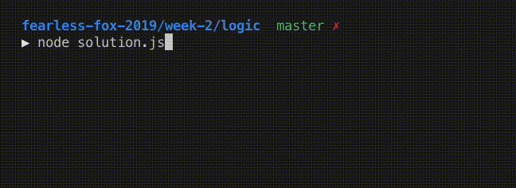

# MondarMandir.js

Kali ini kamu akan diminta membuat sebuah animasi pergerakan hewan yang berjalan sebuah area. Masing-masing hewan akan berjalan secara horizontal, ketika telah mencapai batas area tersebut hewan akan berbalik arah. Dimana luas area dan jumlah hewannya menyesuaikan input yang akan diberikan

## Release 0
Buatlah function `mondarmandir` yang akan menerima 1 parameter berupa `level`, function tersebut akan menampilkan area dan hewan sesuai dengan ketentuan berikut :
- jumlah hewan sejumlah `level` + 1
- ukuran vertical area adalah `jumlah hewan` * 2 + 2
- ukuran horizontal area adalah `level` + 2
- posisi hewan pertama secara vertical ke 2 dari atas dan  horizontal pertama dari kiri
- hewan berikutnya secara vertical diselingi 1 baris dari hewan sebelumnya dan secara horizontal berada di posisi berlawanan dari hewan sebelumnya
- setelah hewan terakhir terdapat 2 baris yang tidak ada hewannya

## Release 1
Melanjutkan dari function `mondarmandir` sebelumnya buatlah hewan tersebut dapat bergerak jika posisi pertama kali hewan ada di sisi paling kanan maka akan bergerak ke kiri, jika paling kiri akan bergerak ke kanan. Ketika hewan telah mencapai batas area maka akan berbalik arah.

```javascript
mondarmandir(1)
```
