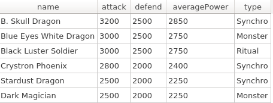

# Yu-Gi-Oh QUERY

> ⏰ Time Estimation: ~20 mins

Dalam section query ini table yang akan digunakan sebagai berikut
  1. Cards, merepresentasikan detail data tiap kartu
  2. Types, merepresentasikan jenis kartu

**Database telah disediakan dan kamu hanya cukup membuat Querynya saja (dalam file solution.txt).**

**Note:**

- Untuk soal ini yang dinilai hanya querynya saja.

## Release 0
`
Tampilkan daftar kartu yang memiliki averagePower (didapat dari (attack + defend) / 2) diatas 2200, diurutkan dari averagePower tertinggi, dan level tertinggi

## Release 1

Tampilkan jumlah Card, rata-rata  attack, rata-rata defend, total dari Types yang mengandung huruf 'o' 
diurutkan dari types dengan total paling banyak, dan diurutkan dari total terbanyak

 
## Release 2
Tampilkan 4 cards yang mengandung kata 'Dragon' , diurutkan berdasarkan level tertinggi,
yang memiliki attack diatas 2300 

