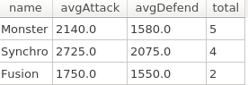
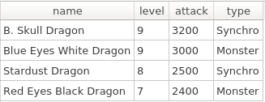

# Yu-Gi-Oh QUERY

> ⏰ Time Estimation: ~20 mins

Dalam section query ini table yang akan digunakan sebagai berikut
  1. Cards, merepresentasikan detail data tiap kartu
  2. Types, merepresentasikan jenis kartu

**Database telah disediakan dan kamu hanya cukup membuat Querynya saja (dalam file solution.txt).**

**Note:**

- Untuk soal ini yang dinilai hanya querynya saja.

## Release 0
`
Tampilkan daftar kartu yang memiliki averagePower (didapat dari attack + defend / 2) diatas 2200, diurutkan dari averagePower tertinggi, dan level tertinggi

SELECT c.name, c.attack, c.defend, (c.attack + c.defend) / 2 as averagePower, t.name as type 
FROM Cards c
INNER JOIN Types t
ON c.typeId = t.id
WHERE averagePower > 2200
ORDER BY averagePower DESC, c.level DESC

## Release 1

Tampilkan jumlah Card, rata-rata  attack, rata-rata defend, total dari Types yang mengandung huruf 'o' 
diurutkan dari types dengan total paling banyak, dan diurutkan dari rata-rata attack terbanyak

`SELECT t.name, AVG(c.attack) as avgAttack, AVG(c.defend) as avgDefend, COUNT(c.id) as total
FROM Types t
INNER JOIN Cards c
ON c.typeId = t.id
GROUP BY t.id
HAVING t.name LIKE '%o%'
ORDER BY total desc, avgAttack desc`

## Release 2
Tampilkan 4 cards yang mengandung kata 'Dragon' , diurutkan berdasarkan level tertinggi,
yang memiliki attack diatas 2300 

`SELECT c.name, c.level, c.attack, t.name as type
	FROM Cards c
	INNER JOIN Types t
	ON t.id = c.typeId
	WHERE c.name LIKE '%Dragon%' AND c.attack > 2300
	ORDER BY level DESC
	LIMIT 4`

