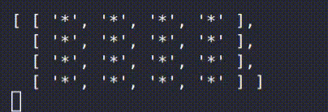

# TEBAK HURUF JS
> ⏰ Time Estimation: 60 mins

Game tebak huruf merupakan permainan mencari pasangan huruf yang sama pada daftar kartu yang diberikan,
player akan menebak beberapa pasang kartu dan menambah poin jika kartu yang ditebak adalah pasangan huruf yang sama.

Kita anggap daftar kartu adalah array multidimensi, dan tiap kartu pada awalnya memiliki posisi terbalik yang dilambangkan dengan simbol *.

Kami sudah menyiapkan skeleton code berupa function - function, kalian bebas untuk menggunakan skeleton code ini atau membuat function baru.

## RELEASE 0 - Generate Board

Buatlah function generateBoard yang berfungsi untuk membuat array multidimensi sesuai dengan input yang diberikan, minimal input yang diberikan 4 dan maksimal input 8.

```
EXAMPLE:

let board =  generateBoard(4)

tebakHuruf()
output: 
[ 
  [ '*', '*', '*', '*' ],
  [ '*', '*', '*', '*' ],
  [ '*', '*', '*', '*' ],
  [ '*', '*', '*', '*' ]
]

generateBoard(1)

output:
'Invalid input parameter'

```

## RELEASE 1 - Generate Letter Coordinate

function generateCoordinate berfungsi untuk mengacak posisi huruf yang akan diletakan, kalian harus membuat 4 pasang huruf.  

function generateCoordinate menerima parameter berupa panjang board yang telah digenerate. Parameter yang dikirim akan digunakan sebagai batas index posisi setiap character. Output dari function ini berupa array of object posisi tiap objek random tapi harus unik.

------------------------


```javascript
generateCoordinate(board.length)  // misal board length == 4

contoh output: 
[
  { chara: 'A', pos: [0, 0] },
  { chara: 'A', pos: [3, 2] },
  { chara: 'B', pos: [0, 1] },
  { chara: 'B', pos: [0, 3] },
  { chara: 'C', pos: [2, 2] },
  { chara: 'C', pos: [0, 2] },
  { chara: 'D', pos: [2, 3] },
  { chara: 'D', pos: [3, 0] }
]
```


## RELEASE 2 - Tebak Huruf

Buatlah function tebak huruf, yang akan menerima parameter berupa board yang sudah digenerate dan posisi - posisi kartu yang akan ditebak, elemen pada parameter haruslah genap.

```
  EXAMPLE: 
  tebakHuruf(dummyBoard, ['3,0', '2,3', '3,3', '2,1', '2,0', '1,1'])
```


