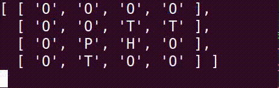

##**PIRATES FIND TREASURE - HARD**
######estimasi waktu: 60 Menit

Seorang Bajak Laut mengarungi lautan untuk mencari semua harta karun di dunia.
Bajak laut memiliki kebiasaan untuk mencari harta karun dari jarak yang terdekat dan belum mau pulang ke pelabuhan jika semua harta karun belum ditemukan.

Tugas kita adalah membantu menghitung jarak yang ditempuh oleh bajak laut pada saat mencari harta karun dan akhirnya pulang ke pelabuhan

Data yg kita miliki adalah string

“OOOOOOTTOPHOOOOO”

**T adalah posisi Treasure / harta karun**
**P adalah posisi Pirates**
**H adalah posisi Harbour / pelabuhan**

### RELEASE 0
Buatlah sebuah board 4x4 dari sebuah string dalam bentuk nested array seperti pada ilustrasi gambar dibawah 

### RELEASE 1
Hitunglah sebuah jarak dengan petunjuk sebagai berikut: 
* Hitung berapa jarak yg ditempuh oleh Pirates berdasarkan kotak yang dilewatinya!
* Pirates selalu mencari posisi Treasure yang terdekat dari tempatnya
* Pirates tidak kembali ke posisi semula jika ia sudah mendapatkan Treasure. Tapi ia akan berangkat dari posisi Treasure yg terakhir didapat.
* Pirates tidak berjalan secara diagonal dan selalu mencari jalan yang pendek
* Pirates tidak pulang ke Harbour jika Treasure belum habis.
* Pirates boleh melewati Harbour lagi atau melewati Treasure lagi
* **Yang dihitung bukan jarak paling efisien melainkan jarak Pirates ke Treasure terdekat dan kembali ke Harbour saja**
### TEST CASE:
>**“OOOOOOTTOPHOOTOO”** // 7 kotak
>**“TOOOOPOHOTOTOTOO”** //14 kotak

### RELEASE 2
Buatlah animasi pada pergerakan pirates sesuai pada gif dibawah ini !

### ILUSTRASI BOARD:

