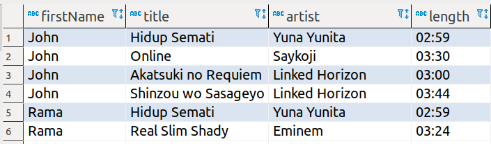

# YuMusic

YuMusic adalah aplikasi playlist music dimana setiap Customer dapat membeli music nya secara online dan musicnya tersimpan kedalam Customer playlist.

## Release 0
Tampilkan Customer dan masing - masing Tracks apa saja yang sudah dia beli.
lalu Order berdasarkan firstName Customer, dan batasi menjadi 6 customer saja yang ditampilkan

## Release 1
Tampilkan genre name, TrackCount nya yaitu jumlah Track dari masing - masing genre , dan Total price dari Track dari masing - masing genre. tapi genre yang ditampilkan hanya yang TrackCount nya lebih dari 2 

## Release 2
Tampilkan Seluruh Data Customer ( id dan Fullname nya saja ) , Jumlah Lagu (TrackCount), serta Total Price yang mereka bayar sesuai dengan price masing - masing lagu Customer. di urutkan ordernya yang paling banyak totalpricenya dahulu 

