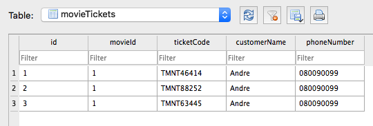

## Live Code Week 3

# FireSale ECommerce


> ⏰ Time limit: **90 min**

Anda ditugaskan untuk membuat app sederhana untuk me-_manage_ penjualan tiket dengan _command-line_.

Sederhananya app ini mengizinkan kita untuk menjual tiket film dengan adanya limitasi batas max seats (jumlah kursi).

App ini akan dibangun menggunakan arsitektur `MVC`, `sqlite3` dan menggunakan `callback`.

### Release 0

Sebelum memulai lakukan `npm init` dan `npm install` untuk module yang dibutuhkan, lalu jalankan **setup** dan **seed** untuk memulai pengoperasian _SQL_.

Ada dua tabel yang akan digunakan, yaitu `movies` dan `movieTickets`, berikut penjelasan masing-masing tabel:

#### Tabel `movies`

| Field    | Description               |
| -------- | ------------------------- |
| id       | ID Film                   |
| code     | Kode film                 |
| name     | Judul film                |
| price    | Harga satuan tiket film   |
| maxSeats | Jumlah maksimal kursi     |
| status   | Status film (OPEN/CLOSED) |

#### Tabel `movieTickets`

| Field        | Description                          |
| ------------ | ------------------------------------ |
| id           | ID tiket film (auto increment)       |
| movieId      | Foreign key menunjuk ke tabel movies |
| ticketCode   | Kode tiket (Unik)                    |
| customerName | Nama Konsumen                        |
| phoneNumber  | Nomor hp customer                    |

Buatlah interface pada `index.js` yg menerima _argument_ dari _command line_, beserta helpnya, berikut daftar _commands_-nya:

```
// menampilkan semua film
$ node index.js movie:all

// menutup film (menandakan film telah berakhir)
$ node index.js movie:close <movieId>

// membeli tiket film
$ node index.js movie:buy <movieId> <name> <phone> <money> <qty>

// menampilkan satu film dengan tiket-tiketnya
$ node index.js movie:view <movieId>

// menghapus film
$ node index.js movie:delete <movieId>
```

1. Buatlah fungsi untuk `Read` semua movie:

```bash
$ node index.js movie:all
Movie List
==========
[CLOSED] Terminator 2
[OPEN] Pulp Fiction
[OPEN] Kill Bill
[OPEN] Django
[OPEN] The Chronicle of Javascript Callback
```

2. Buatlah fungsi untuk `Update` movie:

```bash
$ node index.js movie:close 1

SUCCESS
=======
berhasil menutup film dengan id 1
```

fungsi `movie:close` untuk merubah status film dari `OPEN` menjadi `CLOSED`

```bash
node index.js movie:close 100
SUCCESS
=======
Film tidak ditemukan
```

### Release 1

Buatlah fungsi untuk `Create` movieTicket:

```bash
$ node index.js movie:buy 1 Andre 080090099 1000000 3
SUCCESS
=======
berhasil membuat ticket
```

Perintah diatas akan membuat record movieTicket sebanyak 3 record sesuai inputan parameter `qty`-nya. berikut contoh hasil di database-nya:


Note: ticketCode diambil dari `movies.code` dan 5 angka random

```
node index.js movie:buy 1 Joni 0909090909 1000 3
ERROR
=====
Maaf uang anda tidak cukup untuk membeli tiket ini. harga tiket satuan film Terminator 2 adalah Rp.20000
```

buatlah validasi bila uang yang dibayar tidak mencukupi (qty ticket \* harga ticket) seperti contoh diatas

```
$ node index.js movie:buy 1 Richman 080989999 100000000 10
ERROR
=====
Jumlah ticket melebihi kapasitas bioskop, sisa kursi 7
```

Buatlah validasi bila jumlah tiket yang dipesan melebihi `movies.maxSeats` + jumlah ticket yang sudah dibeli

```
$ node index.js movie:buy 1 Richman 080989999 100000000 2
ERROR
=====
Maaf film ini sudah tidak ditayangkan (sudah closed)
```

bila status film sudah menjadi status `CLOSED`, maka tiket sudah tidak dapat dibeli

```
node index.js movie:buy 999 Richman 080989999 100000000 10
ERROR
=====
Film dengan id 999 tidak tersedia
```

Tampilkan pesan error bila id movie tidak ditemukan

### Release 2

1. Buatlah `delete` movie:

```bash
node index.js movie:delete 1
SUCCESS
=======
Film berhasil di hapus
```

```bash
node index.js movie:delete 2
ERROR
=====
Status film masih open, tidak dapat dihapus

```

```bash
node index.js movie:delete 100
ERROR
=====
film tidak ditemukan
```

Note: fungsi movie:delete juga menghapus relasi pada tabel `movieTickets`

2. Improvisasilah perintah `movie:all` dengan menampilkan (booked/maxSeats) seperti contoh dibawah ini:

```bash
node index.js movie:all
Movie List
==========
[OPEN] Pulp Fiction (3/8)
[OPEN] Kill Bill (1/5)
[OPEN] Django (1/4)
[OPEN] The Chronicle of Javascript Callback (30/30)
```

~ goodluck ~
