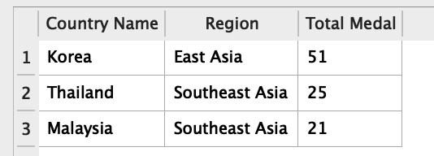
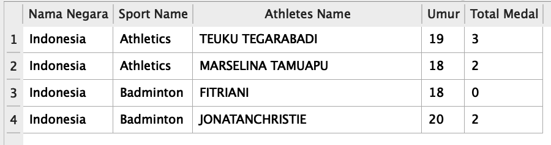
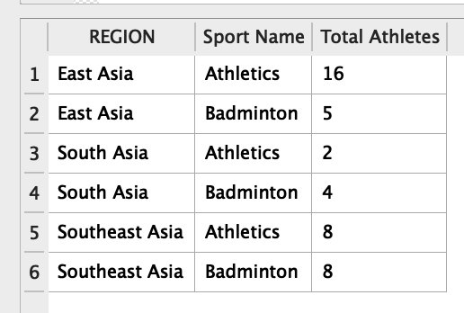

# Query Estimasi 20 menit ⏰

---

Buatlah sebuah query yang akan menghasilkan output sesuai dengan yang diinginkan oleh soal.

Illustrasi yang terdapat dalam soal ini hanya sebagai contoh bagaimana output akan terbentuk, bukan menjadi hasil utama yang akan dihasilkan dari query yang harus dibuat.

## Release 1

Tampilkan 3 Negara pemenang pertama, yang diurutkan berdasarkan total medali. Data yang ditampilkan adalah:

**Ilustrasi hasil data**

## Release 2

Tampilkan atlit yang berusia dibawah 21 tahun dan berasal dari Indonesia. 

**Ilustrasi hasil data**

## Release 3

Tampilkan total atlit berdasar region dan nama cabang atletik.

**Ilustrasi hasil data**

