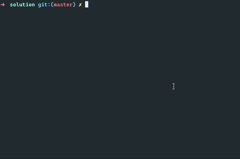

# Lighter Simulator


#### Estimated time 60 minutes

Anda diminta untuk membuat simulasi korek api sederhana menggunakan Javascript di dalam terminal.

## Release 0

App akan menerima input 1 parameter yaitu ukuran api, buatlah validasi bila:
-  App tidak mendapatkan input
-  Input tidak valid (huruf/symbol) 
-  Input kurang dari 3:

```bash
$ node lighter.js
silahkan input ukurannya

$ node lighter.js 2
input minimal 3

$ node lighter.js %
input harus angka
```

Buatlah bentuk api seperti contoh berikut:

- Bila ukuran api adalah 4, maka hasilnya adalah

``` bash
$ node lighter.js 4

   x
  x x
 x   x
x     x
```

- Bila ukuran api adalah 5, maka hasilnya adalah:

```bash
$ node lighter.js 5

    x
   x x
  x   x
 x     x
x       x
```

Silahkan dipikirkan korelasi antara ukuran dan bentuk seperti di atas!

## Release 1

Dari bentuk api yang sudah dibuat sebelumnya tambahkanlah tinggi api beserta alas _lighter_ sesuai dengan input ukuran api yang dimasukkan seperti contoh berikut:

```
$ node lighter.js 5

    x
   x x
  x   x
 x     x
x       x
x       x
x       x
x       x
x       x
 xxxxxxx
=========
```

## Release 2

Melanjutkan bentuk api yang sudah dibuat sebelumnya. Tambahkan inti api dengan tinggi yang didapatkan menggunakan rumus `tinggi api/2` dibulatkan ke atas seperti contoh berikut:

```
$ node lighter.js 5

    x
   x x
  x   x
 x     x
x       x
x       x
x   x   x
x   x   x
x   x   x
 xxxxxxx
=========
```

## Release 3

Tidak selamanya api akan langsung menyala ada beberapa status yang bisa terjadi ketika menyalakan lighter:
- Nyala
- Tidak Nyala
- Macet
- Gas nya kecil

Buatlah sebuah kondisi dimana api hanya akan muncul ketika status lighter nya adalah `Nyala`.

contoh:

```
$ node lighter.js 5
CTEK! Tidak Nyala

$ node lighter.js 5
CTEK! Macet

$ node lighter.js 5
CTEK! Gas nya kecil

$ node lighter.js 5
    x
   x x
  x   x
 x     x
x       x
x       x
x   x   x
x   x   x
x   x   x
 xxxxxxx
=========
```

## Release 4

Buatlah animasi api sebanyak `3` kali dimana setiap animasinya akan menaikkan tinggi api sebanyak `2` kali dan menurunkannya sebanyak `2` kali.




> Selamat mengerjakan!
