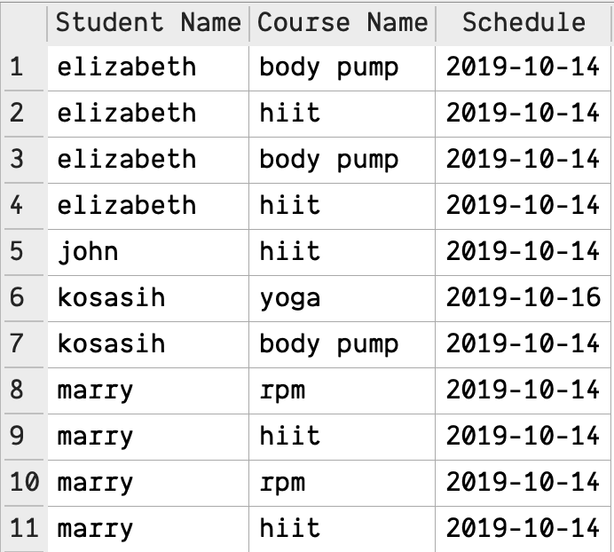
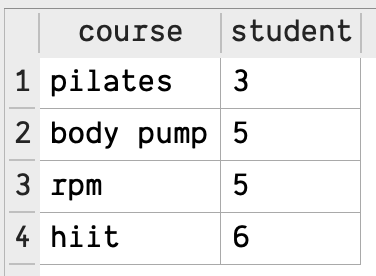
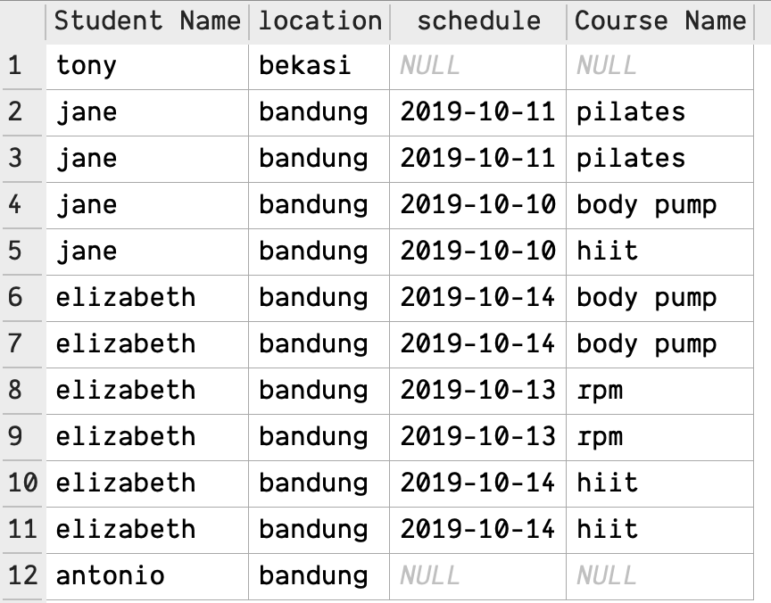

# Hacktiv Fitness Query -> Estimasi 20 menit ⏰

---

Buatlah sebuah query yang akan menghasilkan output sesuai dengan yang diinginkan oleh soal.

**Rules**
- Tidak diperbolehkan menggunakan `sub-query`

 ## Release 1

Tampilkan nama `student`, nama `course` dan `schedule` yang diikuti oleh murid pada tanggal `2019-10-14` dan `2019-10-16` diurutkan berdasarkan nama `student` secara `ascending`

## Release 2

Tampilkan `course-course` yang memiliki `student` lebih dari 2

## Release 3
Tampilkan seluruh nama `student` yang berdomisili **bukan** di jakarta dan  `course-course` yang diikuti oleh murid tersebut bila ada. Diurutkan berdasarkan nama `student` secara `descending` 

