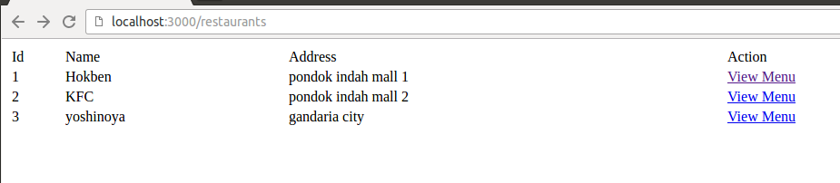

# Restaurant Menu System

## Challenge 1

1. Buat database dengan nama : platinum_livecode4

## Challenge 2

2. Buat table dan column yang dapat menyimpan data tentang:
- Restaurant (name, address)
- Menu (name, menu_type, rating, price)
*semua column ini harus ada, dan nama column harus sama persis*.

Relasi antar kedua table tersebut adalah 1 restaurant memiliki banyak menu, dan 1 menu hanya dimiliki oleh 1 restaurant. Kamu boleh menambahkan column untuk memenuhi spesifikasi tersebut.

## Challenge 3

3. Buat seed data untuk Restaurant (3 data/record)

## Challenge 4

4. Buatlah fitur CRUD (Create - Read - Update - Delete) dari Menu dengan routing sebagai berikut (format routing harus sama persis):

*form add menu berada di page yang sama dengan list menu*

| Method | Route             | What                                                                           |
|--------|-------------------|--------------------------------------------------------------------------------|
| GET    | /menus            | menampilkan list menu dan ada form untuk add menu                              |
| POST   | /menus            | Create menu baru                                                               |
| GET    | /menus/:id/edit   | Menampilkan form edit Menu, dengan default value form dari nilai yang sekarang |
| POST   | /menus/:id/edit   | Update data menu berdasarkan id                                                |
| GET    | /menus/:id/delete | Delete data menu berdasarkan id                                                |

## Challenge 5

**Contoh Halaman list Menu**

## Challenge 6

**Contoh Halaman update Menu**

5. di /menus, rubah isi data dari kolom RestaurantId yang tadinya menampilkan id nya menjadi nama restaurant nya menggunakan method sequelize .

6. buat helper bernama format_currency yang akan digunakan di view, sehingga di /menus, isi data dari kolom price yang tadinya hanya berupa angka, sekarang tampilannya dengan format Rp. [price_with_commas], contoh : awalnya 45000 menjadi Rp. 45,000
Logic untuk format currency nya : 45000.toLocaleString() //output: 45,000

## Challenge 7

**Contoh Tampilan**

7. buat validasi di model sehingga ketika input data menu, menu_type hanya boleh diisi oleh : food atau drink saja. Apabila yang di input selain kedua string tsb, tampilkan error message "Isi menu type dengan food / drink" pada form yang sama.

**Contoh Tampilan**

## Challenge 8

8. buat default value untuk price menggunakan hooks, apabila type nya food dan price nya 0, maka default value nya 15000. Apabila type nya drink dan price nya 0, maka default value nya 10000. pastikan default value ini bekerja ketika create dan update data.

## Challenge 9

9. satu restaurant hanya boleh memiliki 5 varian food dalam menu nya. Misalnya : restaurant 'Hokben' telah memiliki 5 menu yang type nya food, maka ketika create menu baru untuk 'Hokben' dan tipe nya 'food', akan menampilkan error 'Varian Food sudah maksimal !' menggunakan model validation.

## Challenge 10

10. Buat route baru '/restaurants' yang menampilkan semua data restaurant, kemudian untuk setiap record nya terdapat link 'view menu'.

Apabila link tersebut di klik, maka akan mengakses routing /restaurants/restaurant_id/view_menu, kemudian menampilkan semua menu yang ada pada restaurant tsb.

**Contoh Tampilan**

**Contoh Tampilan**

Kemudian, tambahkan sebuah form yang terdapat select option : name, menu_type, rating, price (di hardcode saja) dan input text keyword (lihat screenshot), dan ketika di submit, akan men-search data menu sesuai input user. keyword harus dapat mencari semua data meskipun dimasukkan dengan huruf kecil dan semua data yang mengandung keyword tsb. pada bagian ini, tidak boleh melemper parameter ke URL. Contoh lihat screenshot 

**Contoh Tampilan**

**Contoh Tampilan**

**Contoh Tampilan**
