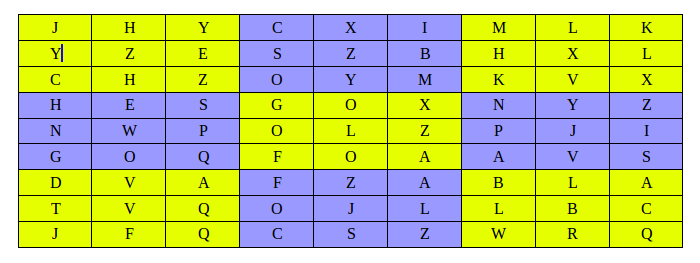

# Alphabet Box

> ⏰ Time Estimation: ~60 mins

**Note**

Untuk soal ini, tidak dibuatkan driver code. Karena itu, lakukan analisa setiap function yang diminta dan sesuaikan parameter-parameter yang dibutuhkan. Fokus dari soal ini adalah logika mengenerate sebuah nested array untuk board dan melakukan pengecekan.

## Release 0

Buatlah sebuah function bernama `generateAlphabetBoard` yang akan menghasilkan nested array sebanyak n x n dan berisikan random huruf a sampai z. n adalah dimensi area box yang diisi oleh user. Jadi misal jika dimensi area box nya adalah 3, maka nested array akan membentuk board 9 x 9. Jika area box adalah 4, maka nested array akan membentuk board 16 x 16.

## Release 1

Terminologi:

- Board = nested array yang menampung papan berisi alphabet.
- Box = area di dalam board. Misal jika board 9 x 9, maka box di dalam board ada 9, dimana masing-masing box ukurannya 3 x 3 (untuk yang 9 x 9 ingat saja papan sudoku). Jika board 16 x 16, maka box di dalam board ada 16.

Buatlah sebuah function bernama `checkConsonantInBox`  yang akan menggunakan board yang dihasilkan oleh function `generateAlphabetBox` yang sebelumnya telah dibuat.

Tugas dari function ini adalah:
1. User menentukan index row dan index column yang diinginkan.
2. Berdasarkan index row dan column yang ditentukan, kita bisa mendapatkan area box yang ditargetkan.
3. Cek semua alphabet di dalam box tersebut, dan cek apakah semuanya berisi konsonan (huruf mati) atau tidak. DILARANG membuat variable yang isinya HURUF KONSONAN semua.
4. Function akan mereturn boolean. `true` jika semua alphabet dalam area box tersebut konsonan semua, dan `false` jika paling tidak ditemukan salah satu yang bukan konsonan.

Spesifikasi function `checkConsonantInBox` sebagai berikut:

**EXAMPLE CASE FOR 9 x 9**

- Warna kuning dan ungu adalah ilustrasi pembagian area box
- index row 1 dan index column 7 (area box kuning kanan atas), area box nya semua huruf konsonan. Maka hasil nya `true`
- index row 0 dan index column 0 (area box kuning kiri atas), area box nya tidak semua huruf konsonan. Maka hasil nya `false`