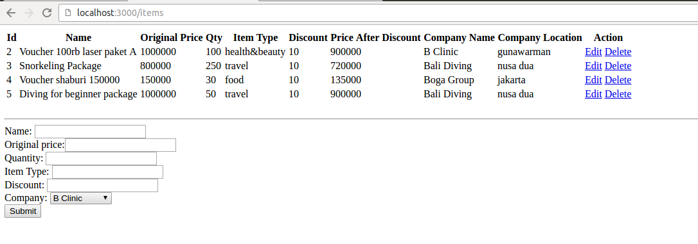
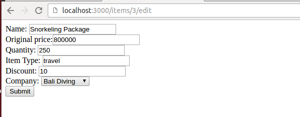
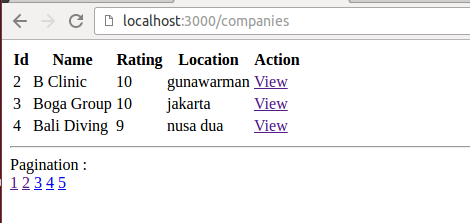
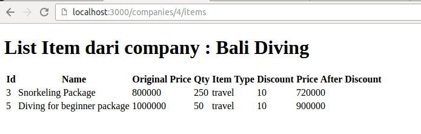
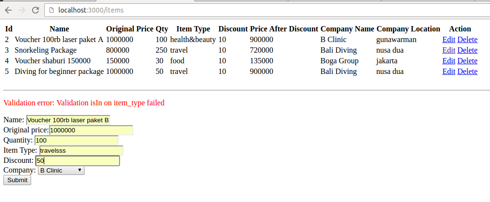
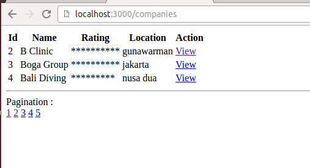
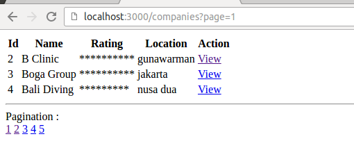
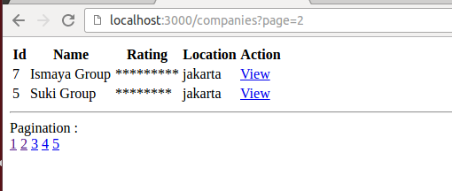

Buatlah aplikasi sederhana bernama 'Simple Groupon'. Aplikasi ini akan memiliki banyak company yang bekerja sama dengan kita, untuk menjual voucher2 nya. Nama database HARUS simple_groupon

Buat aplikasi dengan spesifikasi sbb :

1. Buatlah model dengan struktur sbb :

company : name(string), rating(string), location(string)

item : name(string), original_price(integer), qty(integer), item_type(string), idr_discount(integer)

2. Lakukan perubahan struktur database :
- ganti `tipe data` column rating di company menjadi `integer`
- ganti `nama column` idr_discount di item menjadi `discount`

4. Relasi antar 2 tabel tersebut adalah 1 company memiliki banyak item. Tambahkan column sesuai kebutuhan ini dan tambahkan juga relasi antar 2 table tsb.

5. Buat seed data untuk company sebanyak 5.

6. Buat CRUD untuk items menggunakan format routing :
- GET /items (menampilkan semua data items dan ada form untuk add new items)
- POST /items (untuk memasukkan data item)
- GET /items/[id]/edit (untuk mengedit data item, pada halaman ini masing2 input box nya **HARUS** ter-populate data yang di edit nya)
- GET /items/[id]/delete (untuk menghapus data delete)
*format* routing harus sama

7. Pada halaman item, tampilkan juga nama & lokasi company menggunakan method sequelize yang tepat.

8. Modifikasi halaman yg menampilkan items (/items), Ada 1 kolom pada *tampilan* tersebut bernama 'price after discount', dimana isinya merupakan harga setelah dipotong discount (formula nya : price - (price * discount/100) ). Modifikasi code pada model tanpa merubah struktur database yang sudah ada.

9. Buat halaman Company menggunakan format routing `/companies`, tambahkan link view dengan route /companies/[id]/view yang ketika di klik menampilkan semua data items nya menggunakan **accessor** (tidak boleh menggunakan .find dll)

10. Berikan validasi pada model item, sehingga item_type yang di input harus salah 1 di antara : food, health&beauty, travel, activity. Apabila tidak valid, akan menampilkan pesan error : "Validation error: Validation isIn on item_type failed"

11. Buatlah sebuah validasi pada model, dengan ketentuan sbg berikut : Apabila nominal rupiah diskon nya lebih besar dari 100,000 maka harus menampilkan pesan error pada form tsb 'Diskon terlalu besar.' (referensi tampilan error spt screenshot no 10)

12. Ketika input dan update item, apabila name nya mengandung kata cafe atau restaurant DAN item_type nya kosong, maka secara default item_type diisi oleh 'FOOD'. Apabila name nya mengandung kata hotel / rental, maka default item_type nya diisi oleh 'TRAVEL'. **Dilarang** menggunakan before validate.

13. Modifikasi tampilan company pada bagian rating nya. Rating yang tadinya isinya berupa angka, rubah menjadi * sebanyak rating nya tsb. Tanpa merubah model & controller, dan tanpa memasukkan logic process di view, pikirkanlah code tsb harus diletakkan dimana paling tepatnya ?

14. Buatlah fitur 'pagination' pada halaman company. Setiap halaman, data yang ditampilkan hanya 3 data. untuk link pagination nya, boleh di hardcode saja dari 1 - 5, setiap angka pagination tsb, memiliki link ke routing dengan format : /items?page=[nomor_page]

