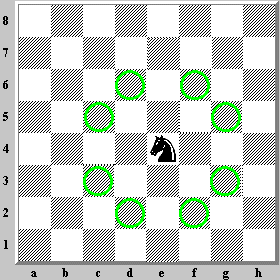

# Lompatan Kuda

dalam sebuah permainan catur. bidak kuda dapat berpindah tempat seperti huruf L

dalam permainan catur terdapat papan 8 x 8
tugas kamu adalah menghitung jumlah kemungkinan jalannya suatu bidak kuda dihitung dari posisi kudanya

contoh seperti di gambar bidak kuda sedang berada di posisi E4 maka output yang di harapkan adalah 8 karena kuda dapat bergerak sebanyak 8 kemungkinan posisi

```javascript
console.log(lompatanKuda('A1')) // 2
console.log(lompatanKuda('G7')) // 4
console.log(lompatanKuda('C4')) // 8
```