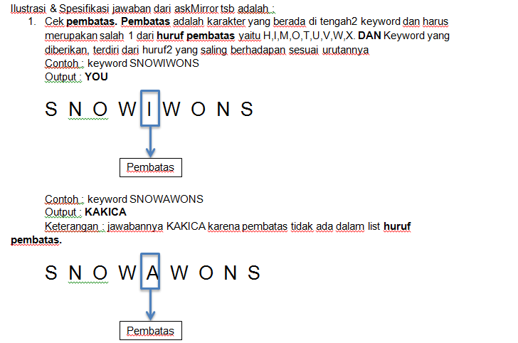
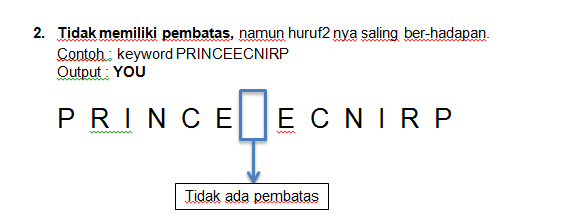

Who’s the fairest of them all ?

Buatlah sebuah function bernama **askMirror** dimana km dapat bertanya "who’s the fairest" dengan menyebutkan sebuah **keyword** ! Lihat driver code dibawah ini : 

function askMirror(keyword) {

}

**Lihat driver code untuk contoh lebih lanjut !**

