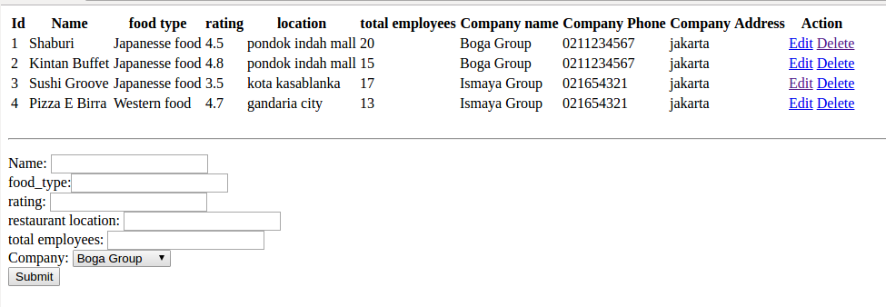
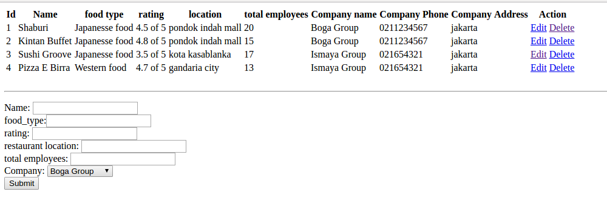
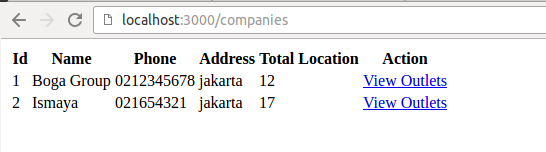
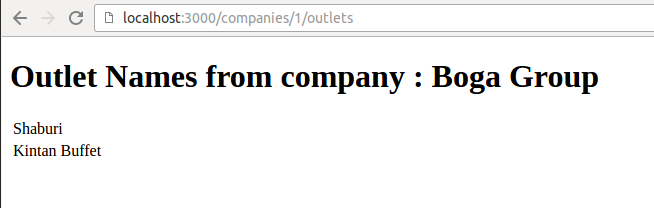
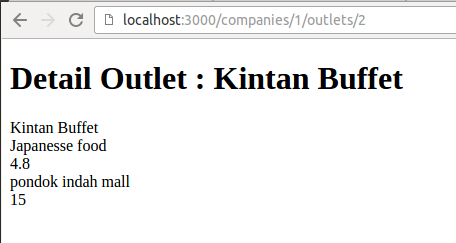
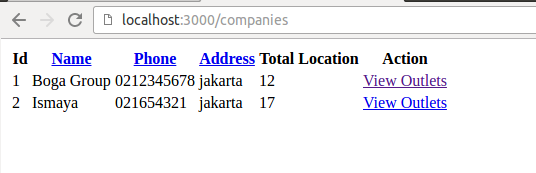
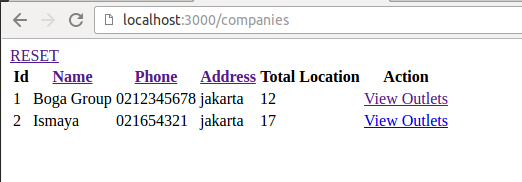
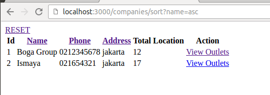
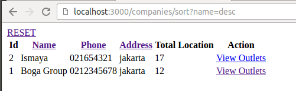

Buatlah aplikasi sederhana bernama 'food_companies'. Aplikasi ini akan menyimpan data company yang memiliki banyak outlet restaurant.

Nama database **HARUS** 'food_companies'

Buat aplikasi dengan spesifikasi sbb :

1. Buatlah model dengan struktur sbb :

company : name(string), phone(string), address(string), total_outlets(integer)
outlet : name(string), food_type(string), rating(integer), restaurant_location(string), total_employees(integer)

2. Lakukan perubahan struktur database :
- modifikasi kolom name pada outlet agar menjadi unique
- ganti nama column `restaurant_location` di outlet menjadi `location`

4. Relasi antar 2 tabel tersebut adalah 1 company memiliki banyak outlets. Tambahkan column sesuai kebutuhan ini dan tambahkan juga relasi antar 2 table tsb.

5. Buat seed data untuk company sebanyak 5 data.

6. Buat CRUD untuk outlet menggunakan format routing :
- GET /outlets (menampilkan semua data items dan ada form untuk add new outlets)
- POST /outlets (untuk memasukkan data outlets)
- GET /outlets/[id]/edit (untuk mengedit data outlets, pada halaman ini masing2 input box nya **HARUS** ter-populate data yang di edit nya)
- GET /outlets/[id]/delete (untuk menghapus data delete)

*keterangan*
- routing harus sama
- ketika add / edit outlets, ada pilihan company berupa drop down.

7. Pada halaman item, tampilkan juga nama, phone dan address company menggunakan method sequelize yang tepat.

8. Berikan validasi pada model outlet, sehingga rating yang di input harus di antara angka 1 - 5. Apabila tidak valid, akan menampilkan pesan error pada **FORM** create / edit tsb.

9. Pada halaman yg outlet (/outlets), pada *tampilan* tersebut kolom yang bernama 'rating', dimana isinya yang tadinya hanya berupa angka rating nya, sekarang menjadi : X of 5. Modifikasi code pada model tanpa merubah struktur database yang sudah ada.

10. Buat halaman Company menggunakan format routing `/companies`, tambahkan link 'view outlets' dengan route /companies/[id]/outlets yang ketika di klik menampilkan NAMA  outlet nya menggunakan **accessor** (tidak boleh menggunakan .find dll)

11. Tambahkan link 'detail' untuk setiap nama outlet dengan route /companies/[id]/outlets/[id_outlet] yang ketika di klik menampilkan detail outlet nya.

12. Ketika input dan update outlet, apabila food type nya TIDAK mengandung kata 'food', maka akan menambahkan secara otomatis kata 'food' di belakangnya. Contoh : food type yg di input : Japanesse, maka yang di save ke database adalah 'Japanesse food'.
**GUNAKAN** before/after create & update.

13. Modifikasi tampilan company pada bagian phone nya sehingga tampilannya memiliki format phone number. Contoh phone number : 1234567890 menjadi 1-234-567-890. Gunakan regex ini : "1234567890".replace(/(\d)(?=(\d{3})+(?!\d))/g, "$1-")  
Tanpa merubah model & controller, dan tanpa memasukkan logic process di view, pikirkanlah code tsb harus diletakkan dimana paling tepatnya ?

14. Buatlah fitur 'sort' pada halaman company. Rubah nama kolom di company seperti name, phone, address yang tadinya berupa string biasa menjadi sebuah link.  

Ketika di klik, maka sorting nya akan berubah2 dr yg awalnya ASCENDING menjadi DESCENDING, dan selanjutnya. Lihat detail nya di bawah ini :  

Ketika `name` di klik PERTAMA kali, link nya akan menuju ke routing : /companies/sort?name=asc  
Ketika `name` di klik KEDUA kali, link nya akan menuju ke routing : /companies/sort?name=desc  
Lihat contoh screenshot :

Begitu pun dengan phone & address. 
Ketika `phone` di klik PERTAMA kali, link nya akan menuju ke routing : /companies/sort?phone=asc   
Ketika `phone` di klik KEDUA kali, link nya akan menuju ke routing : /companies/sort?phone=desc    

Ketika `address` di klik PERTAMA kali, link nya akan menuju ke routing : /companies/sort?address=asc   
Ketika `address` di klik KEDUA kali, link nya akan menuju ke routing : /companies/sort?address=asc   

Untuk mendapatkan parameter setelah tanda "?" pada url, gunakan req.query 

Untuk me-reset sorting nya, buat 1 link baru 'reset', dan akan menuju ke : /companies
