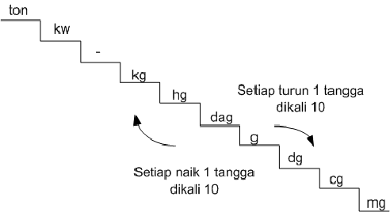

# Satuan Berat
# Estimation time : 40mins

Satuan berat adalah ukuran yang dipakai untuk mengukur berat, jenus satuan berat tsb adalah sbb :



keterangan :
1 ton = 10 kw = 1000 kg
1 kw = 100 kg
1 kg = 1000 mg
1 kg = 10 ons    
1 ons  = 1 hg

Buatlah sebuah function bernama 'convertWeight' (NAMA FUNCTION HARUS SAMA) yang akan menerima 2 parameter. Parameter tsb adalah :
1. soal pertambahan satuan berat berupa string, contoh : '1 ton +10 ons+2 kwintal'
2. tujuan akhir konversi yang diinginkan, contoh : 'kg'

**DILARANG** hardcode ! misalnya : <br>
di hardcode satu per satu konversi nya, ton ke kwintal dikali 10, ton ke kg dikali 1000, ton ke gr dikali 10000, dll. pikirkan cara agar bisa dinamis tanpa di hardcode. 


Lihat contoh driver code dibawah ini :

```
console.log(convertWeight('1 ton +10 ons+2 kwintal', 'kg'))

\\expected output:
1201 kg
```

```
console.log(convertWeight('1 ton +10 ons+2 kwintal', 'g'))

\\expected output:
1201000 g
```

```
console.log(convertWeight('2 ton +500 kwintal+3 kg+350 ons', 'kg'))

\\expected output:
52038 g
```
