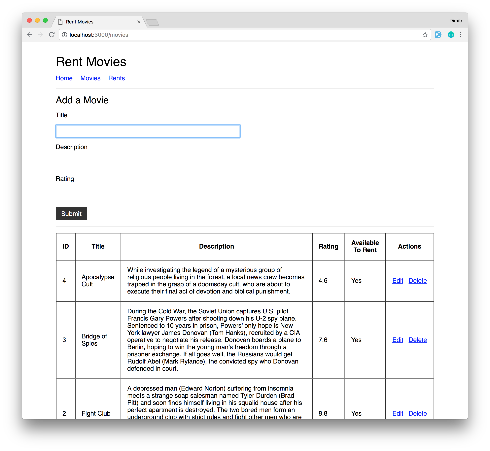
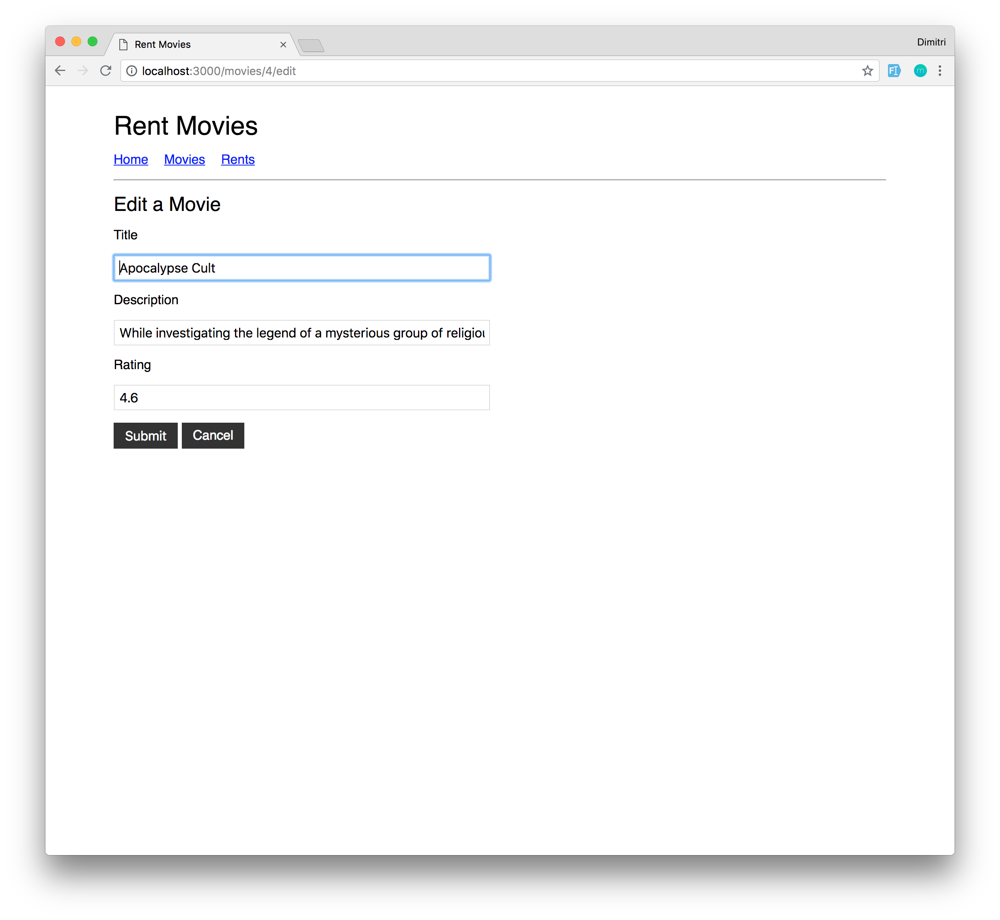
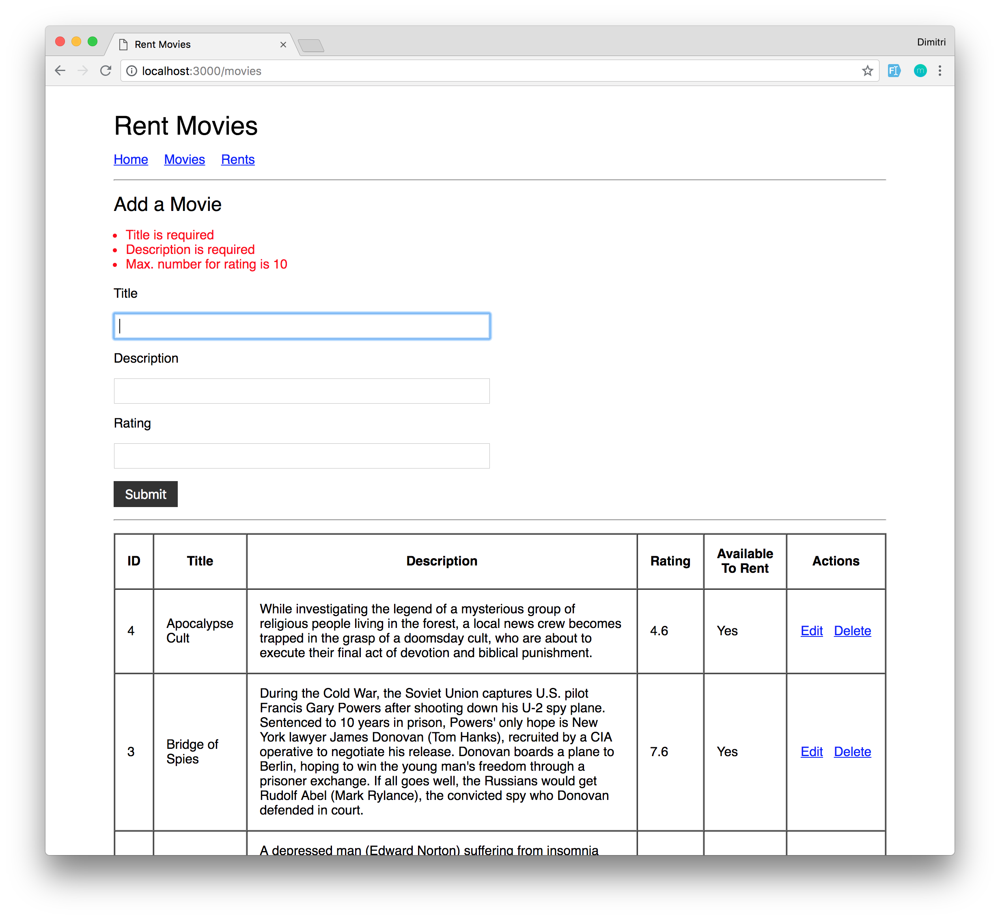
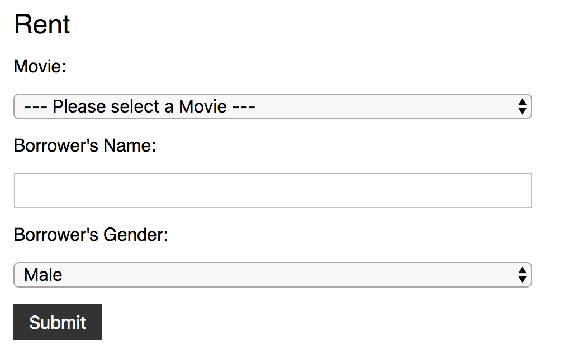
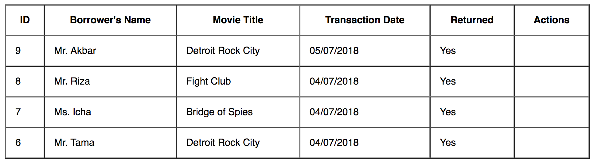
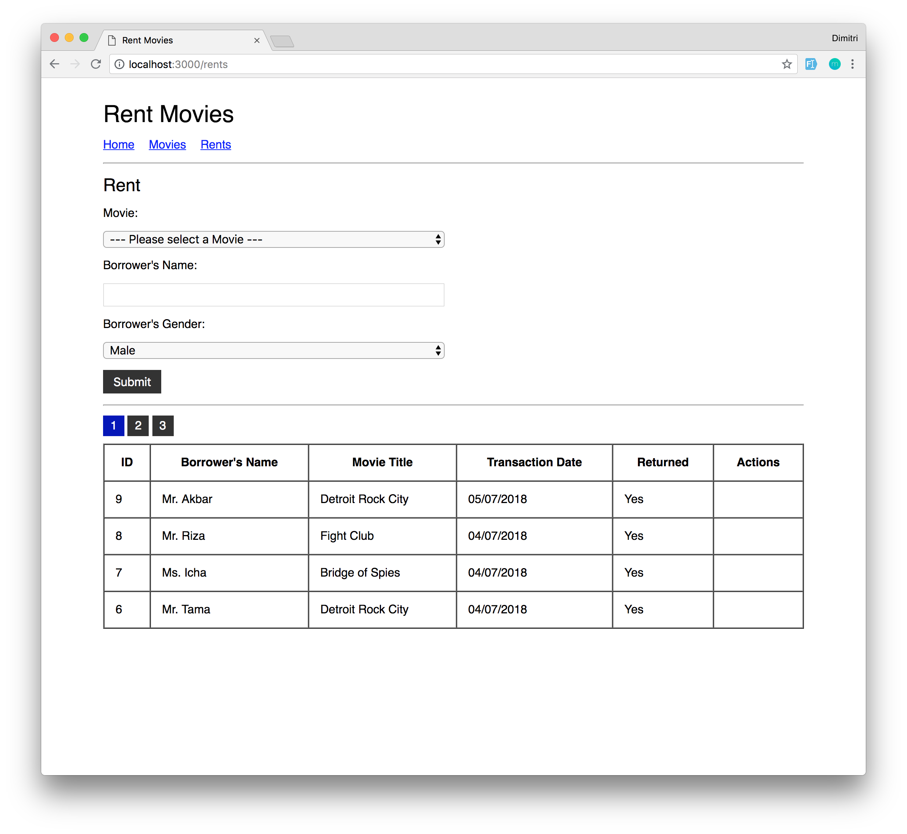

# Rent Movies

Challenge kali ini adalah membuat aplikasi movie rental sederhana menggunakan **Express** and 
**Sequelize**.
Baca tiap *specification* dengan baik, ikuti apa yang diminta.

## Demo Aplikasi

## Spec 0
Install dependencies seperti: `express`, `sequelize`, dll. Inisialisasi project kalian menggunakan
command yang disediakan oleh `sequelize`. Isi konfigurasi database, database *HARUS* diberi nama
**treasure_live_code_week_4**

## Spec 1
Buat semua *migration* yang diperlukan oleh aplikasi ini:
- Movies
  - `title (string)`
  - `description (string)`
  - `rating (float)`
  - `availableToRent (boolean)`
- Rents
  - `borrowerName (string)`
  - `borrowerGender (string)`
  - `returned (boolean)`

Relasi antar kedua *table* adalah 1 `Movie` memiliki banyak `Rent`. Kamu boleh menambahkan kolom baru untuk memenuhi relasi tersebut, selain itu **HARUS** mengikuti *requirement* di atas.

## Spec 2
Buat 2 *migration* baru. Satu untuk mengubah *default value* kolom `availableToRent` menjadi `true`. Satu lagi untuk mengubah *default value* `returned` menjadi `false`

## Spec 3
Buat *seed* untuk mengisi `Movies`. (4 records)

## Spec 4
Buat fitur **CRUD** untuk *Movies*. Format routing **HARUS SAMA PERSIS** dengan ketentuan sebagai berikut:

| Method | Route             | Description    |
|--------|-------------------|----------------|
| GET    | `/movies`            | Menampilkan data `Movies` |
| POST   | `/movies`            | Create `Movie` baru |
| GET    | `/movies/:id/edit`   | Menampilkan form edit `Movie` dengan isi nilai `Movie` yang akan di-edit |
| POST   | `/movies/:id/update` | Update data `Movie` berdasarkan `id` |
| GET    | `/movies/:id/delete` | Delete data `Movie` berdasarkan `id` |

NOTE: Untuk route `GET /movies`, tampilkan `Movies` yang telah diurutkan berdasarkan tanggal data tersebut dibuat. (Dari yang paling baru ke yang paling lama)

## Spec 5
Buat halaman untuk menampilkan `Movies` dan *form* untuk menambahkan `Movie`, contoh:

## Spec 6
Buat halaman untuk edit `Movie` dimana semua data nya ter-*populate* sebagai value di masing-masing input-nya. contoh:

## Spec 7
Buat validation sesuai keterangan berikut:
- `Movie`
  - `title` harus diisi
  - `description` harus diisi
  - `rating` harus diisi
  - `rating` hanya bisa diisi *angka* (contoh: `10`, `5.5`, `4.2`)
  - `rating` hanya bisa diisi oleh range angka dari `1` sampai `10`
- `Rent`
  - `movieId` harus diisi
  - `borrowerName` harus diisi
  - `borrowerGender` harus diisi

Contoh tampilan untuk `validation error` kurang lebih seperti ini:

Note: *Styling* tidak harus sama persis

## Spec 8
Buat fitur **Rent** untuk meminjam *Movie*. Format routing **HARUS SAMA PERSIS** dengan ketentuan sebagai berikut:

| Method | Route             | Description    |
|--------|-------------------|----------------|
| GET    | `/rents`            | Menampilkan data `Rents` |
| POST   | `/rents`            | Create `Rent` baru |
| GET    | `/rents/:id/return`   | Mengembalikan movie (ganti status `Movie` yang dikembalikan menjadi *available*) |

## Spec 9
Buat halaman/form dan routes untuk untuk menambahkan data pinjaman (`Rent`) contoh:

NOTE: Data `Movies` yang ditampilkan di dalam pilihan **HARUS** movie yang *available* untuk dipinjam dan diurutkan sesuai abjad (A-Z).

## Spec 10
Buat fungsi pada `Model` untuk mengganti status ketersediaan movie menjadi `false` ketika `Rent` dibuat dan fungsi untuk mengubah menjadi `true` saat movie dikembalikan. (Dilarang mengganti secara langsung dari `Controller` atau `Routes`!)

## Spec 11
Buat fungsi untuk mengubah format tanggal yang kita ambil dari database menjadi `'TANGGAL/BULAN/TAHUN'` (contoh: `'19-11-2018'`) tanpa mengubah `Model` atau `Controller`/`Routes` !

## Spec 12
Buat sebuah method untuk menampilkan *title* dari nama peminjam movie (`borrowerName`) berdasarkan `borrowerGender`. Jika `'Male'` maka tambahkan *title* `'Mr.'` dan jika `'Female'` maka tambahkan `'Ms.'` pada model tanpa mengubah struktur table

## Spec 13
Buat halaman untuk menampilkan `Rents`, urutkan data berdasarkan tanggal data tersebut dibuat (Dari yang paling baru ke yang paling lama). Contoh:

NOTE:
- Untuk menampilkan `'Mr.'`/`'Ms.'` harus sesuai dengan `Spec 13`
- Untuk menampilkan tanggal yang sudah di-format harus sesuai dengan `Spec 12`

## Spec 14
Buat fitur *pagination* untuk data `Rents`. Setiap halaman hanya akan menampilkan 4 baris data, dan
jumlah dari halaman tergantung dari jumlah data yang ada di database, contoh *pagination*:

