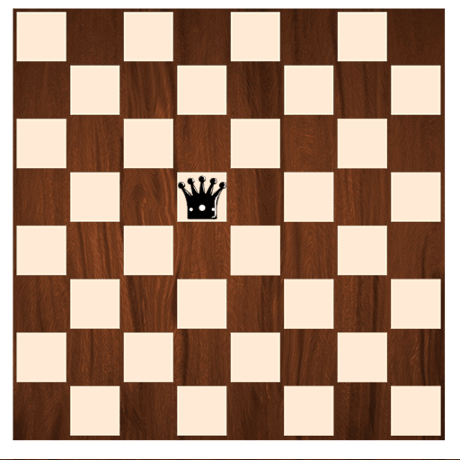
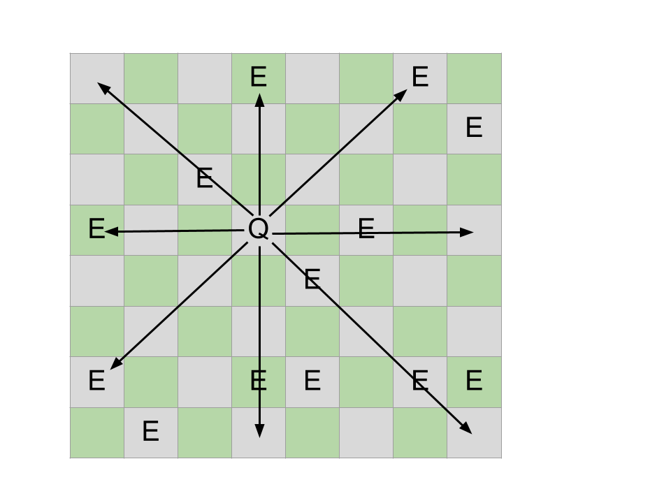

# QUEEN'S MOVE

> ⏰ Time Estimation: ~90 mins

Kamu pasti tahu dengan permainan catur. Pada permainan catur terdapat bidak Ratu/Queen.
Queen pada permainan catur adalah bidak yang paling kuat karena kemampuannya untuk
berpindah/bergerak ke atas, bawah dan diagonal.

Buatlah function untuk menghitung berapa banyak bidak enemy yang berada pada jalur
Queen.

## ILUSTRASI BOARD:

### output:
There are 9 enemies on Queen's way

**NOTE:**

**1. TEST CASE LAIN ADA PADA FILE template.js**

**2. QUEEN TIDAK AKAN PERNAH LEBIH DARI SATU**
