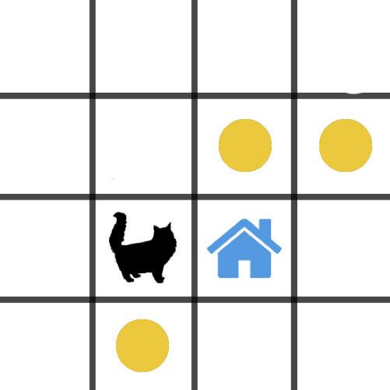

##**KUCING MENCARI MAKAN - HARD**
######estimasi waktu: 60 Menit
Seekor kucing sedang dalam keadaan lapar ingin mencari makan karena majikannya kehabisan makanan. Kucing ini memiliki kebiasaan mencari makanan dari jarak yang terdekat dan kucing belum mau pulang ke rumah jika makanan di sekitar rumahnya belum habis. 

Tugas kita adalah membantu menghitung jarak yang ditempuh oleh si kucing pada saat mencari makan dan akhirnya pulang ke rumah

Data yg kita miliki adalah string

“OOOOOOMMOKROOOOO”

**M adalah posisi makanan yang ada di sekitar rumah**
**K adalah posisi kucing**
**R adalah posisi rumah**

### RELEASE 0
Buatlah sebuah board 4x4 dari sebuah string dalam bentuk nested array seperti pada ilustrasi gambar dibawah 

### RELEASE 1
Hitunglah sebuah jarak dengan petunjuk sebagai berikut: 
* Hitung berapa jarak yg ditempuh oleh si kucing berdasarkan kotak yang dilewatinya!
* Kucing selalu mencari posisi makanan yang terdekat dari tempatnya
* Kucing tidak kembali ke posisi semula jika ia sudah mendapatkan makanan. Tapi ia akan berangkat dari posisi makanan yg terakhir dimakan.
* Kucing tidak berjalan secara diagonal dan selalu mencari jalan yang pendek
* Kucing tidak pulang ke rumah jika makanan belum habis.
* Kucing boleh melewati rumah lagi atau melewati makanan lagi
* **Yang dihitung bukan jarak paling efisien melainkan jarang kucing ke makanan terdekat dan kembali ke rumah saja**
### TEST CASE:
>**“OOOOOOMMOKROOMOO”** // 7 kotak
>**“MOOOOKOROMOMOMOO”** //14 kotak

### ILUSTRASI BOARD:

