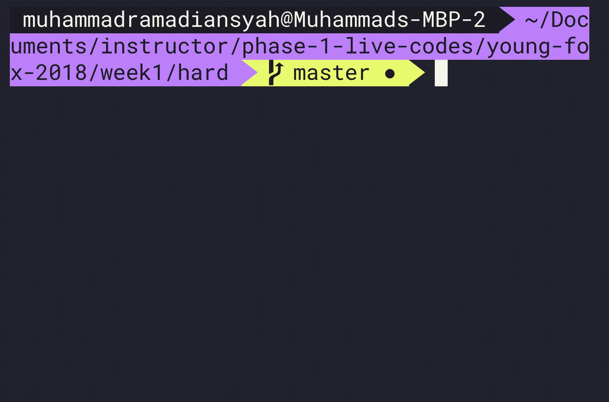

# KUCING MENCARI TIKUS #
###### estimasi waktu: 60 Menit

  Pada suatu hari seekor kucing sedang ingin berburu seekor tikus karena lapar. Pada kasus ini tugas kita adalah mencari tahu apakah seekor kucing tersebut dapat memakan seekor tikus dengan petunjuk-petunjuk yang diberikan.
  
  Untuk menyelesaikan permasalahan tersebut diberikan 2 object input animal dengan detail sebagai berikut:
  ```javascript
  let cat = {
    icon: "C",
    moves: ["right, down, up, up, bottom"],
    pos: [1, 2] 
  }

  let mouse = {
    icon: "M",
    pos: [3, 2]
  }
  ```
  **Details :**
  - Attribut icon merupakan penanda pada board untuk membedakan kucing atau tikus
  - Attribut moves merupakan kumpulan langkah-langkah kucing. ***Yang memiliki jumlah langkah hanya kucing, tikus hanya diam ditempat*** Untuk kasus ini hanya ada 4 jenis langkah yaitu 
    - "atas" / "up"
    - "bawah" / "down"
    - "kanan" / "right"
    - "kiri" / "left".
  - Attribut pos merupakan koordinat awal seekor kucing atau tikus. Nilai koordinat tersebut merupakan koordinat dari x dan y pada board.

#Rules : #
  1. Kucing akan terus bergerak dan berubah posisi sebanyak attribute movesnya
  2. Apabila sampai akhir attribute moves baik pada kucing maupun tikus tidak saling bertemu maka fungsi akan mengembalikan nilai ***Kucing gagal memakan tikus***
  3. Apabila ditengah perjalanan atau diakhir perjalanan kucing bertemu dengan tikus maka fungsi akan mengembalikan nilai ***Kucing berhasil memakan tikus***
  4. ***Tidak perlu membuat ilustrasi seperti pada contoh***

# Examples #

### Case Gagal Memakan Tikus
```javascript
  let cat = {
    icon: 'C',
    moves: ['down', 'right', 'right', 'down', 'down'],
    pos: [0, 1] // Posisi awal
   }
  let mouse  = {
    icon: 'M',
    pos: [4, 4] // Posisi awal
   }
  console.log(catFindMouse(cat, mouse))
  /*
    Keterangan:
       M  = Posisi Tikus
      -C- = Posisi Awal Kucing
      #C# = Posisi Akhir Kucing

       0   1   2   3   4
     ---------------------
   0 |   |-C-|   |   |   |
     ---------------------
   1 |   | C | C | C |   |
     ---------------------
   2 |   |   |   | C |   |  
     ----------------------
   3 |   |   |   |#C#|   |
     ----------------------
   4 |   |   |   |   | M |
     ----------------------
  Output: 
  Kucing gagal memakan tikus

  Karena kucing tidak bertemu dengan tikus sampai akhir
  */
```

### Case Berhasil Memakan Tikus

```javascript
  let cat = {
    icon: 'C',
    moves: ['down', 'right', 'right', 'down', 'left'],
    pos: [2, 2] // Posisi awal
   }
  let mouse  = {
    icon: 'M',
    pos: [3, 3] // Posisi awal
   }
  console.log(catFindMouse(cat, mouse))

  /*
    Keterangan:
       M  = Posisi Tikus
       C  = Jejak Kucing
      -C- = Posisi Awal Kucing
      #C# = Posisi Akhir Kucing

       0   1   2   3   4
     ---------------------
   0 |   |   |   |   |   |
     ---------------------
   1 |   |   |   |   |   |
     ---------------------
   2 |   |   |-C-|   |   |  
     ----------------------
   3 |   |   | C | C |   |
     ----------------------
   4 |   |   |   |   |   |
     ----------------------

  Output: 
  Kucing berhasil memakan tikus

  Karena kucing bertemu tikus atau berada di koordinat yang sama walaupun si kucing belum berjalan sampai habis.
  */
```

# RELEASE #

  ### RELEASE 0 ###
  Dapatkan koordinat-koordinat pergerakan pada kucing berdasarkan petunjuk dari attribut moves pada masing-masing objek

  ### RELEASE 1 ###
  Dapatkan informasi apakah kucing berhasil atau gagal dalam memakan tikus yang merupakan nilai yang akan dikembalikan oleh function tersebut

## ILLUSTRATION
#### Test Case 1

#### Test Case 2


